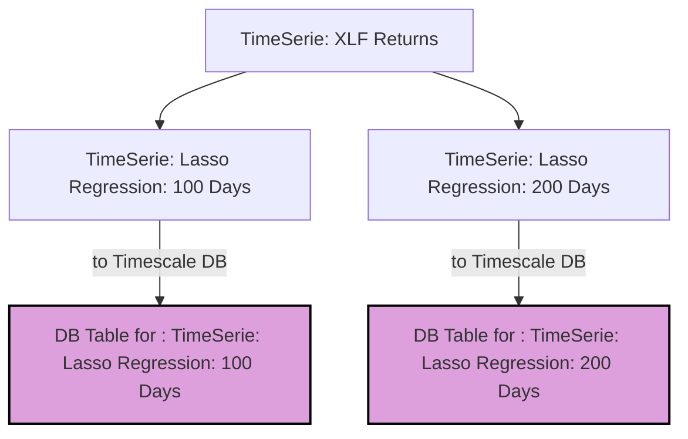
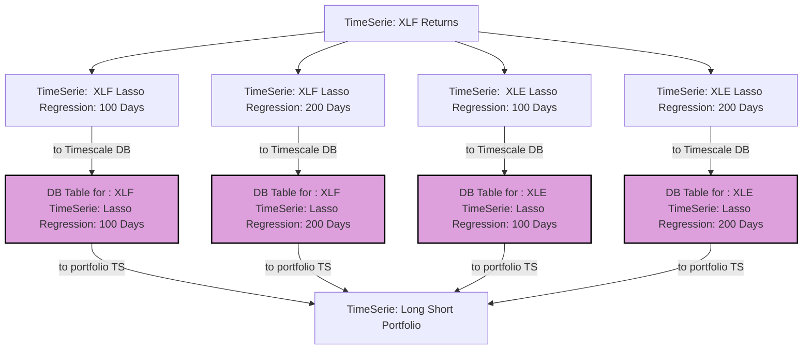

# Part 1: TimeSeries 

Let’s start with a simple example and progressively build upon it. Suppose we want to **replicate** a fund for which we
don’t know the exact components—this could be an ETF (Exchange-Traded Fund) or a closed-end fund. Since we don’t know
the components, we will adopt a **data-driven approach** to estimate the underlying assets.

To make it more concrete, let’s assume we want to replicate the **S&P 500 Financial Sector**. A good proxy for this
sector is the **XLF ETF**. Our goal is to replicate the performance of XLF by identifying its components using
historical data. Since we don't have the exact components, we'll run a **regularized rolling regression**.

For regularization, we’ll use **Lasso (Least Absolute Shrinkage and Selection Operator)** because it has the desirable
property of setting certain weights to zero due to its **L1 regularization**, effectively selecting only the most
important assets in our replication.

## Rolling Regression with Lasso

### 1. Fixed Window Regression (Pseudo-code)

Before we dive into rolling regressions, let's first outline the process for a **fixed window** regression using Lasso:

- Collect the historical returns for XLF and the individual stocks from the S&P 500 Financial Sector.
- Run the Lasso regression for a given period (e.g., last 60 days).
- Use the Lasso coefficients to identify the most important stocks for that period.

In pseudo-code:

```python
# Pseudo-code for fixed window Lasso regression
for each window in historical_data:
    X = get_returns_for_stocks_in_window(window)
    y = get_returns_for_XLF_in_window(window)
    model = Lasso(alpha=λ)  # λ is the regularization parameter
    model.fit(X, y)
    coefficients = model.coef_
    select_significant_assets(coefficients)
```

### 2. Maintainability of Our Pipeline**

What we want to achieve now is to write the code that performs this rolling regression and have a system that runs this
code automatically, say every day at 11 PM. Additionally, we need to ensure that the results are persisted so they can
be extracted, reused, and integrated into other processes. Of course, we want to accomplish this in a simple and
extendable way. This is where our first **Tdag Helper** comes in: a **TimeSerie** object.

## Tdag Time Series

In simple terms, a **Tdag TimeSerie** is an object of type `TimeSerie` that controls the following three main tasks:

1. **Updating Logic**: It contains the logic for updating a time series based on its last update.
2. **Linked to Storage**: It is linked to a storage solution. By default, we use **TimeScaleDB** for storing the data.
3. **Uniqueness Guarantee**: It guarantees that the persisted data is unique for each combination of parameters.

For example, if we have a `TimeSerie` that performs a rolling regression using the last 100 days of data, this
`TimeSerie` should be different from a `TimeSerie` that uses the last 200 days. This ensures the uniqueness of each time
series instance based on its specific configuration.



To achieve this structure, **TDAG** will automatically handle the hashing process and ensure that we have two distinct
sets
of data based on our arguments. Let's see how we can achieve this in code.

First, we extend the **TimeSerie** class with the arguments that we require; in this case, these are the size of the
rolling window and the regularization parameter. The decorator `@TimeSerie._post_init_routines` is necessary to perform
all the magic behind **TDAG**.

```python
from mainsequence.tdag import TimeSerie
from utils import BarTimeSerie


def get_prices_bars():
    ...


class ETFReplicator(TimeSerie):

    @TimeSerie._post_init_routines()
    def __init__(self, lasso_alpha: float, in_window: int = 60, *args, **kwargs):
        super().__init__(*args, **kwargs)
        self.in_window = in_window
        self.lasso_alpha = lasso_alpha
        self.bars_ts = BarsTimeSerie()  # a time serie with the prices
```

As you can see, the initialization is quite simple. We just need to define the parameters that will uniquely define our
time series: in this case, `lasso_alpha` and `in_window`. It is important to mention that we are referencing another
time series with `BarTimeSerie`.

Now the next step is to add the logic to get the coefficients. This is also quite simple. Here, we use the **TimeSerie**
method `get_df_from_table_after_date` to retrieve only the new data that we need. Important observations are:

1. If **latest_value** is None, it means that the time series has never been updated, so we need to handle this logic.
2. We always use UTC dates in the database to ensure compatibility.

```python
from mainsequence.tdag import TimeSerie


def get_lasso_coefficients():
    ...


class ETFReplicator(TimeSerie):
    def update(self, latest_value: Union[datetime, None], *args, **kwargs) -> pd.DataFrame:
        if latest_value is None:
            latest_value = datetime.datetime(2010, 1, 1).replace(tzinfo=pytz.utc)
        start_value = latest_value - datetime.timedelta(days=self.in_window)
        prices = self.bars_ts.get_df_from_table_after_date(start_value)

        prices = prices.reset_index().pivot_table(index='time_index', columns='asset_symbol',
                                                  values=self.assets_configuration.price_type.value)
        weights = get_lasso_coefficients(prices, self.lasso_alpha)
        return weights

```

And thats all with only this lines of code this pipeline will be updated systmetaically and persisted into our database
Lets get a litte more complicated. As you perhaps noticed in the previous code we are not defining at any point the
asset that we want to replicate so we should add this to the initialization. Now also lets suppose that we want to build
a portfolio that goes long a replication of the XLF and goes short a replication of XLE which is the energy sector of
the S&P500.

Also, for the sake of stability, let’s build this portfolio where each leg is the average weight of the 100-day and
200-day rolling regression. For sake of simplicit lets leave on lasso_alpha for all regression but this is something
we could easily change.

First, let’s modify our initialization method to include the ticker that we want to replicate.

```python
class ETFReplicator(TimeSerie):

    @TimeSerie._post_init_routines()
    def __init__(self, lasso_alpha: float, ticker_to_replicate: str, in_window: int = 60, *args, **kwargs):
        super().__init__(*args, **kwargs)
        ...
```

now lets look at how our portfolio `TimeSerie` will look like

```python

class LongShortPortfolio(TimeSerie):
    @TimeSerie._post_init_routines()
    def __init__(self, ticker_long: str, ticker_short: str, long_roling_windows: list, lasso_alpha: float,
                 short_rolling_windows: list, *args, **kwargs):
        super().__init__(*args, **kwargs)
        long_ts = {f"ts_{i}": ETFReplicator(lasso_alpha=lasso_alpha, ticker_to_replicate=ticker_long,
                                            in_window=i
                                            ) for i in long_roling_windows}
        short_ts = {f"ts_{i}": ETFReplicator(lasso_alpha=lasso_alpha, ticker_to_replicate=ticker_long,
                                             in_window=i
                                             ) for i in short_rolling_windows}
        self.long_ts = long_ts
        self.short_ts = short_ts
        self.lasso_alpha=lasso_alpha
        

long_short_portfolio = LongShortPortfolio(ticker_long="XLF", ticker_short="XLE", long_rolling_windows=[100, 200, ],
                                          short_rolling_windows=[100, 200],lasso_alpha=1e-2
                                          )

```

That’s all! With only these few lines of code, we have a fully integrated data pipeline that will update our portfolio
automatically. What is more important on this example is how you can build the pipelines as building blocks but agnostic 
of how the previous block was build. you dont even neeed to know from how many other TimeSeries this block belongs. 
This process make it extremely powerfull to stack while keeping a clean and lean code. 

The graph of this pipeline should look something like this:



As you can see, even with this simple example, the pipelines are becoming increasingly complex. Now imagine integrating
data from a different source—let’s say U.S. economic data from the Federal Reserve. Perhaps you also want to interpolate
or filter the prices in a specific way. What about adding sentiment analysis from internet searches? And how about a
machine learning model that requires feeding with thousands of different signals and needs to be retrained every two
weeks?

This is just for one pipeline tied to a single portfolio. Now imagine wanting to maintain multiple portfolios, each
tailored for different profiles. Surely, you wouldn’t want to manage this using a spreadsheet or countless Jupyter
notebooks, right?

now lets look at how we can start scheduling our pipelines. continue to [Part 2 Running Pipelines](running_time_series_part2.md)
