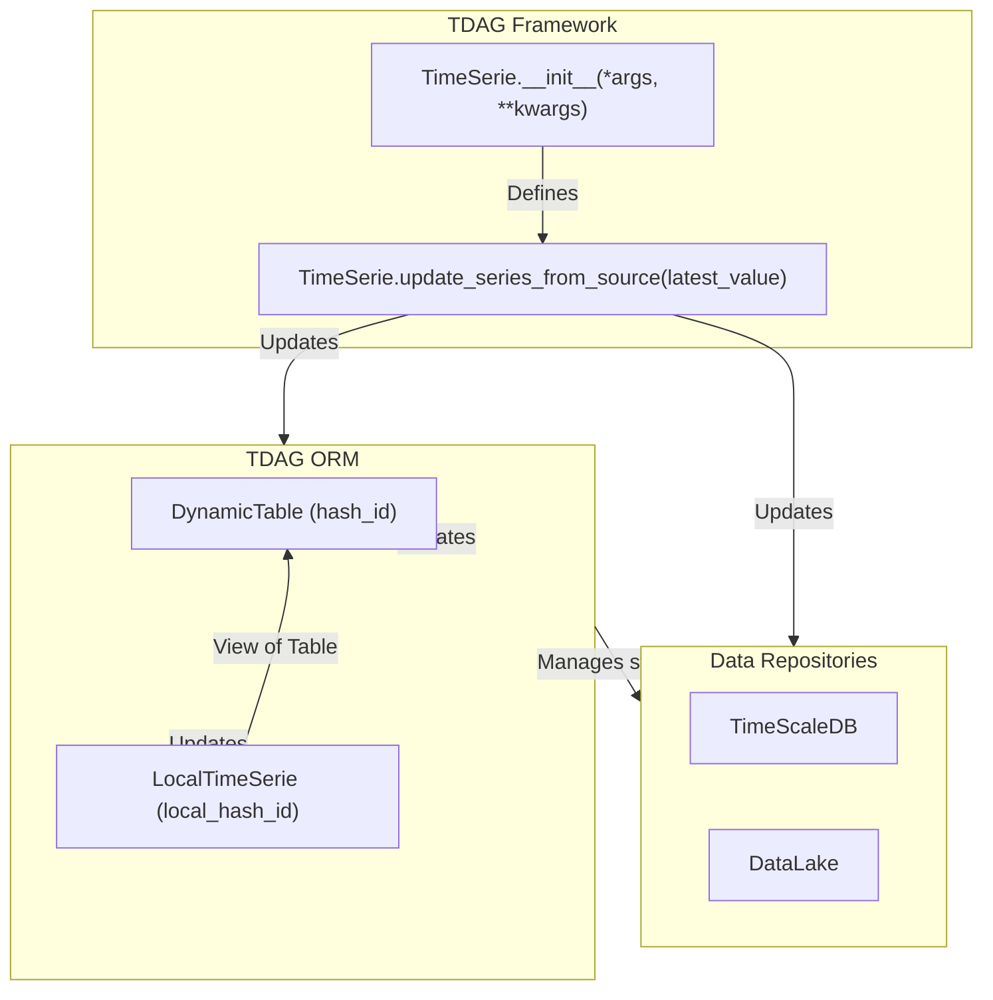
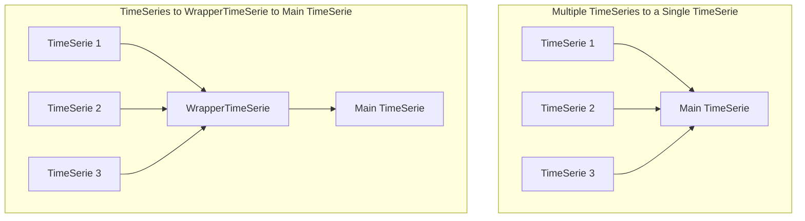

# Time Series Fundamentals

The core of TDAG is the TimeSerie class. A TDAG TimeSerie uniquely defines a process responsible for updating a time
series based on the last available value.

An update process in terms of TDAG involves the following:

Updating a DataRepository with the new data generated by the pipeline process.
Updating an ORM with the state of the data and the pipeline's updates.

The `TimeSerie` class is primarily defined by two key methods:

1. The `__init__` method, which constructs the initial details and configuration of the class.
2. The `update_series_from_source(latest_value=None)` method, which handles updating the time series with new data
   starting from the latest value.

By defining these two methods, it will be enough to make a time series work and be able to interconnect with other time
series.



Let’s dive into the details of each of these methods.

## `__init__` Method

```python
def __init__(self, init_meta=None,
             build_meta_data: Union[dict, None] = None,
             local_kwargs_to_ignore: Union[List[str], None] = None,
             data_configuration_path: Union[str, None] = None,
             *args, **kwargs):
    ...
```

The `__init__` method is particularly important in TDAG as it helps us hash the process and, hence, link it to our data
repository. All the arguments in the `__init__` method will be used to create two unique hashes:

1. **hash_id**: Represents the unique hash of the data repository linked to the `TimeSerieProcess`.
2. **local_hash_id**: Represents the unique hash of the process that is updating the data repository.

It is easier to understand why we need hashing when we look at an example. Imagine that you have two different
portfolios represented as a **TDAG**. One portfolio uses prices from financial sector stocks, while the other portfolio
uses prices from technology stocks. Both pipelines depend on the `TimeSerie` for stock prices. However, we don’t want to
update the database of prices for all stocks when we only need updates for financial or technology stocks. At the same
time, we also don’t want to have separate tables for each subsection of stocks.

**TDAG** helps us with this by creating a unique `hash_id` for the table that holds the prices and a unique `hash_id`
for the process that will be updating this table.

All the arguments of the constructor (`__init__`) will be used to create these hashes, with the exception of the
following:

- **init_meta**: This is arbitrary metadata that can be passed during initialization. In more advanced examples, we may
  encounter cases where several time series have the same dependencies, so this can help in construction.
- **build_meta_data**: This is metadata that does not get included in the time series hash but can be recovered at any
  point. For example, if we have a `TimeSerie` that points to a database and we want the address to remain unhashable
  and editable from the front end, we can set it up here.
- **local_kwargs_to_ignore**: This is a list of strings with the names of the arguments that will be excluded from *
  *hash_id** but not from **local_hash_id**.

By last it is important that everytime we build a TimeSeries we decorate the ``__init__`` constructor
in the following way

```python
from mainsequence.tdag import TimeSerie


class NewTimeSeries(TimeSerie):
    @TimeSerie._post_init_routines
    def __init__(self):
        ...
```

### TimeSeries Dependencies

The `__init__` method is also responsible for building the dependency tree of each of our TimeSeries. In contrast to
other data pipeline managers, TDAG performs code introspection, which allows us to only declare the direct dependencies
of a time series. The only thing we need to do is declare the dependencies as attributes in our constructor, for
example.

```python

class NewTimeSeries(TimeSerie):
    @TimeSerie._post_init_routines
    def __init__(self, asset_symbols: List[str], *args, **kwargs):
        self.prices_time_serie = PricesTimeSerie(asset_symbols=asset_symbols)

```

### TimeSeries Pickle

Each `TimeSeries` instance **saves** its state as a pickle file **upon** its **first** initialization. **This approach speeds up** the **loading process for** time series data. Once a time series is pickled, **all subsequent updates within** a TDAG pipeline **will use** the pickled object.

Each time a time series is pickled, **its code is hashed, and a unique identifier is assigned**. **This allows TDAG to determine when the time series needs to be re-pickled.** To ensure the pickled time series **remains up-to-date**, every `TimeSeries` instance **introspects itself on initialization, comparing** its **current** code hash with the hash stored in the TDAG explorer. If the hashes **differ, the** `TimeSeries` instance **will be rebuilt** instead of loaded from the pickle.


## `update_series_from_source` Method

```python
   def update_series_from_source(self, latest_value: Union[None, datetime.datetime], *args, **kwargs) -> pd.DataFrame:
    """
    This method performs all the necessary logic to update our time series. The method should always return a DataFrame with the following characteristics:

    1) A unidimensional index where the index is of the type `DatetimeIndex` and the dates are in `pytz.utc`.
    2) A multidimensional index that should always have 3 dimensions: `time_index` (with the same characteristics as before), `asset_symbol`, and `execution_venue_symbol`.

    Parameters
    ----------
    latest_value
    args
    kwargs

    Returns
    -------

    """
```

This method performs all the necessary logic to update our time series. The method should always return a DataFrame with
the following characteristics:

1) A unidimensional index where the index is of the type `DatetimeIndex` and the dates are in `pytz.utc`.
2) A multidimensional index that should always have 3 dimensions: `time_index` (with the same characteristics as
   before), `asset_symbol`, and `execution_venue_symbol`.

As can be seen in the signature of the method, `latest_value` can be `None`. When the value is `None`, it means that the
TimeSerie has never been updated successfully before. When it is not `None`, it will give us the latest value in our
data repository for this time series.

## Other methods to perform updates

While the previous two methods are enough to perform updates, there are many cases in which we need additional helpers
to make the update seamless. I will describe in detail some of the most commonly used methods.

### `get_df_greater_than_in_table`

```python
def get_df_greater_than_in_table(self, target_value: Union[None, datetime.datetime],
                                 great_or_equal=False,
                                 force_db_look=True, symbol_list: Union[None, list] = None,
                                 ) -> pd.DataFrame:
    ...
```

This method gives you the data in the repository greater than the `target_value`. It is helpful for retrieving data for
dependencies during the update process. In several methods, we will encounter the `symbol_list` argument, which helps
filter requests by the second axis of a multi-index, specifically the `asset_symbol`.

### `get_last_observation`

```python
def get_last_observation(self, asset_symbols: Union[None, list] = None,
                         ):

```

Returns the last observation of a TimeSerie as a pandas DataFrame

### The WrapperTimeSerie Class

```python
class WrapperTimeSerie(TimeSerie):
    """A wrapper class for managing multiple TimeSerie objects."""

    @TimeSerie._post_init_routines()
    def __init__(self, time_series_dict: Dict[str, TimeSerie], *args, **kwargs):
```

The `WrapperTimeSerie` class is an intermediate helper class that helps us group several `TimeSerie` instances in a
declarative form. This helper class is useful when we have a group of similar time series, and we want to manage them
together.




