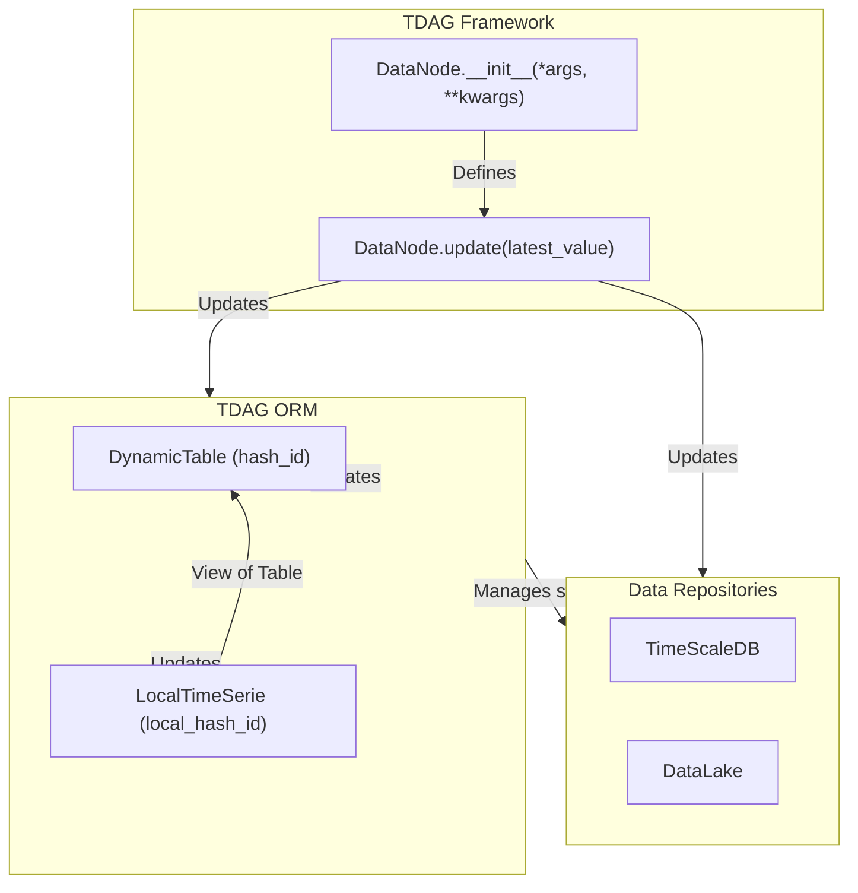

# Time Series Fundamentals in TDAG

TDAG's core revolves around the concept of time series, encapsulated in the powerful `DataNode` class. Each `DataNode` object manages the process of updating data, reflecting the most current available information. It interacts seamlessly with databases and maintains a robust internal state, supporting efficient data pipelines.

## Understanding the Update Process

In TDAG, updating involves:

- **Updating DataRepositories**: Stores the generated data from the update process.
- **Updating ORM**: Manages the internal state of the data and the pipeline.

The following diagram illustrates these interactions:



## Initializing a DataNode

The constructor (`__init__`) defines the initial state and configuration:

```python
def __init__(self, *args, **kwargs):
    ...
```

### Hashing Mechanism

The constructor arguments create two essential hashes that facilitate efficient management of data and updates:

- **`hash_id`**: Used to uniquely identify data repositories linked to a specific `DataNode`. This ensures different configurations or datasets are appropriately separated or merged based on their content rather than their names alone.

- **`local_hash_id`**: Used to uniquely identify the specific update processes. It enables TDAG to recognize distinct update routines and manage their internal state independently, crucial for parallel updates or workflows that reuse identical data structures with different update logic.

### Special Constructor Arguments

Some arguments are explicitly excluded from hashing:

- **`init_meta`**: Arbitrary metadata used during initialization for convenience and clarity. **excluded from hashing**
- **`build_meta_data`**: Metadata recoverable anytime and editable from the GUI; useful for dynamic or interactive data handling. **excluded from hashing**
- **`local_kwargs_to_ignore`**: Arguments excluded from the `hash_id` calculation but included in `local_hash_id`, allowing flexibility in differentiating between datasets and update processes.

### Post Init Decorator Usage

Always decorate the constructor to ensure proper integration with TDAG. 
This decorator is responsible for executing all synchronization routines necessary to initialize the TDAG engine.


```python
from mainsequence.tdag import DataNode

class NewTimeSeries(DataNode):
    
    @DataNode._post_init_routines
    def __init__(self,*args,**kwargs):
        ...
```

### Managing Dependencies with Introspection

TDAG simplifies dependency management by automatically detecting dependencies through introspection. Rather than manually managing complex dependency trees, developers only need to explicitly declare direct dependencies as class attributes. TDAG then builds the full dependency graph internally.

Example:

```python
class NewTimeSeries(DataNode):
    @DataNode._post_init_routines
    def __init__(self, asset_symbols: List[str], *args, **kwargs):
        # Explicitly declare direct dependency
        self.prices_time_serie = PricesTimeSerie(asset_symbols=asset_symbols)
```

TDAG automatically understands that `NewTimeSeries` depends on `PricesTimeSerie` and manages updates accordingly.

### State Persistence with Pickles

TDAG pickles each `DataNode` after its first initialization, significantly reducing load times in future updates. The pickle state is automatically updated when the underlying code changes, ensuring consistency and efficiency.

## Updating a DataNode

The `update` method performs all the necessary logic to fetch, calculate, and store new data points in the series. It uses a parameter called `latest_value`, representing the most recent timestamp from previous updates. If `latest_value` is `None`, the series has never been updated successfully before. Otherwise, it continues from the given point.

Example:

```python
def update(self, update_statistics: DataUpdates, *args, **kwargs) -> pd.DataFrame:
    # Perform update logic based on latest_value
    new_data = self.fetch_new_data_since(latest_value)
    processed_data = self.calculate_metrics(new_data)
    return processed_data
```

Returned DataFrame requirements:

- **Unidimensional index**: `DatetimeIndex` in `pytz.utc`.
- **Multidimensional index**: two dimensions: `time_index` in `pytz.utc`., `unique_identifier`.

