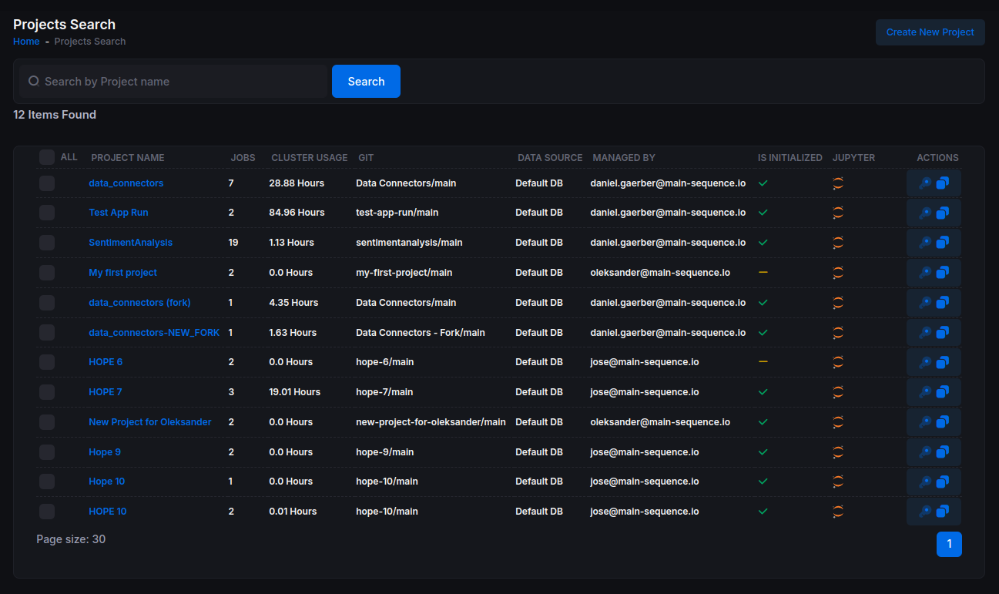
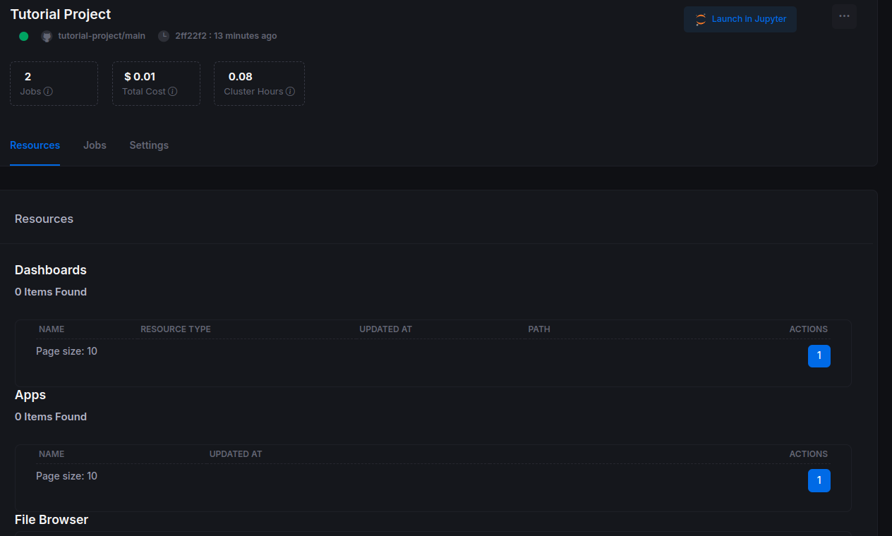
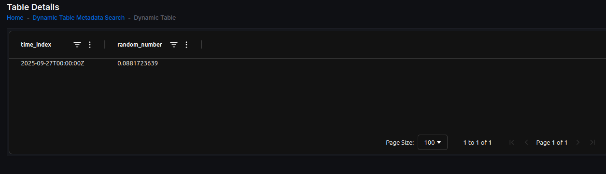
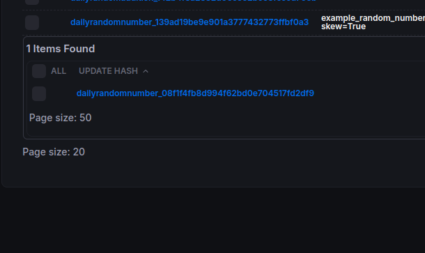

# Getting Started with Main Sequence Part 1

This tutorial walks you through creating a project, setting it up on your local machine, and building your first data nodes. The goal is to make each step clear and actionable while preserving all the examples and screenshots from your original guide.

you can see the final repository here: https://github.com/mainsequence-sdk/tutorial-project/blob/main/README.md 

## 1. Create a Project

Log in to Main Sequence. You’ll land on the **Projects** page. Projects help you organize work, data, and compute. Let’s create the first one: choose **Create New Project** and name it **Tutorial Project**.




After a few seconds, your new project should appear with a checkmark indicating it’s initialized. Click the project to open it.


On the **Project Details** page you’ll see:
- A green status indicator confirming the project was set up correctly.
- The repository and branch (e.g., `tutorial-project/main`) and the latest commit.
- Two **Jobs** representing background processes—no action needed for now.



## 2. Work on the Project Locally

We’ll use **Visual Studio Code** for the tutorial. If you don’t have it, download it from the official site.

First, install the Main Sequence Python package in your environment:

```shell
pip install mainsequence
```

With the package installed, you can use the CLI from your machine:

```shell
mainsequence --help
# or if your system does not allow automatic additions ot the path
python -m mainsequence --help
```


Now log in via the CLI:

```shell
mainsequence login [USER_NAME]
```

You should see a list of your projects:

```text
Projects:
ID  Project                       Data Source  Class         Status     Local  Path                                                                  
--  -------                       -----------  -----         ------     -----  ----                                                                  
60  TutorialProject                Default DB   timescale_db  AVAILABLE  —      —                                                                     
```

The **Path** column is empty because the project isn’t mapped locally yet. Use the project command to see your options:

```shell
python -m mainsequence project --help
                                                                                                                                                                                                                                              
 Usage: mainsequence project [OPTIONS] COMMAND [ARGS]...                                                                                                                                                                                      
                                                                                                                                                                                                                                              
 Project commands                                                                                                                                                                                                                             
                                                                                                                                                                                                                                              
╭─ Options ──────────────────────────────────────────────────────────────────────────────────────────────────────────────────────────────────────────────────────────────────────────────────────────────────────────────────────────────────╮
│ --help          Show this message and exit.                                                                                                                                                                                                │
╰────────────────────────────────────────────────────────────────────────────────────────────────────────────────────────────────────────────────────────────────────────────────────────────────────────────────────────────────────────────╯
╭─ Commands ─────────────────────────────────────────────────────────────────────────────────────────────────────────────────────────────────────────────────────────────────────────────────────────────────────────────────────────────────╮
│ list                   List projects with Local status and path.                                                                                                                                                                           │
│ open                   Open the local folder in the OS file manager.                                                                                                                                                                       │
│ delete-local           Unlink the mapped folder, optionally delete it.                                                                                                                                                                     │
│ open-signed-terminal   Open a terminal window in the project directory with ssh-agent started and the repo's key added.                                                                                                                    │
│ set-up-locally                                                                                                                   
```

Map the project to your machine and list again to confirm the mapping:

```shell
python -m mainsequence project set-up-locally  [PROJECT_ID]

python -m mainsequence project list
ID  Project                       Data Source  Class         Status     Local  Path                                                                  
--  -------                       -----------  -----         ------     -----  ----                                                                  

60  Tutorial Project              Default DB   timescale_db  AVAILABLE  Local  /home/user/mainsequence/my_organization/projects/tutorial-project   
```

Once mapped, you’ll see the project under your `mainsequence` folder structure (for example, a `src` directory with a `data_nodes` module, plus typical files like `pyproject.toml`, `README.md`, and `requirements.txt`).

Open VS Code and select your Python environment (the tutorial was written using Python 3.11.9). We’ll use **uv** to manage dependencies and dev workflow.

Activate your virtual environment and install `uv`:

```shell
sh-5.2$ source .venv/bin/activate
(.venv) sh-5.2$ pip install uv
```

Sync dependencies from `requirements.txt`:

```shell
uv sync
```

From now on, add libraries with:

```shell
uv add libary_name
```

If your project depends on environment variables, verify they’re set (for example, `VFB_PROJECT_PATH`).

## 3. Build Your First Data Nodes

**Key concepts:** data DAGs, `DataNode`, dependencies, `update_hash`, and `storage_hash`.

Main Sequence encourages you to express workflows as data DAGs—composing work into small steps called **data nodes**, where each node performs a transformation. Create a new file at `src/data_nodes/example_nodes.py` and define the first node, `DailyRandomNumber`, by extending `DataNode`.

```python
class DailyRandomNumber(DataNode):

    def __init__(self,node_configuration:RandomDataNodeConfig, *args, **kwargs):
        ...
```

### DataNode Recipe

To create a data node we must follow the same recipe every time
1) Extend the base class mainsequence.tadg.DataNode
2) Implemente the constructor method __init__
3) Implement the get_dependencies method
4) Implement the  update() method

#### the update()

the update method has only one requirement and is that it should return a pandas.DataFrame with the following charactersitics

* Update method always needs to return a pd.DataFrame()
* Your first index should always be of type datetime.datetime(time_zone="UTC") and should not have duplicates
* Your columns should be always lower cap and no more than 63 characters
* Your column types are only allowed to be float, int, str for dates you need to transform to int or float


Next, create `scripts/random_number_launcher.py` to run the node. (We leave code exactly as you wrote it—imports and all.)

```python
from .src.data_nodexes.example_nodes import DailyRandomNumber, RandomDataNodeConfig
_


daily_node = DailyRandomNumber(node_configuration=RandomDataNodeConfig(mean=0.0))
daily_node.run(debug_mode=True, force_update=True)
```

To run and debug in VS Code, you can configure a launch file:

```json
{
    "version": "0.2.0",
    "configurations": [
        {
            "name": "Debug random_number_launcher",
            "type": "debugpy",
            "request": "launch",
            "program": "${workspaceFolder}/scripts/random_number_launcher.py",
            "console": "integratedTerminal",
            "env": {
                "PYTHONPATH": "${workspaceFolder}"
            },
            "python": "${workspaceFolder}/.venv/bin/python"
        }
        
    ]
}
```

Use **Run and Debug** in VS Code to execute the configuration, then open:

https://main-sequence.app/dynamic-table-metadatas/

Search for `dailyrandom`. You should see your data node and its table.


Click the **storage hash**, then in the table’s context menu (the **…** button), select **Explore Table Data** to confirm that your node persisted data.



### Add a Dependent Data Node

Now extend the workflow with a node that depends on `DailyRandomNumber`. Add the following to `src/data_nodes/example_nodes.py`:

```python
class DailyRandomAddition(DataNode):
    def __init__(self,mean:float,std:float, *args, **kwargs):
        self.mean=mean
        self.std=std
        self.daily_random_number_data_node=DailyRandomNumber(node_configuration=RandomDataNodeConfig(mean=0.0)
                                                             ,*args, **kwargs)
        super().__init__(*args, **kwargs)
    def dependencies(self):
        return {"number_generator":self.daily_random_number_data_node}
```

This simply defines a **dependent** node (`DailyRandomAddition`) that references and uses the output of `DailyRandomNumber`.

Create a launcher at `scripts/random_daily_addition_launcher.py`:

```python
from src.data_nodes.example_nodes import DailyRandomAddition


daily_node = DailyRandomAddition(mean=0.0, std=1.0)
daily_node.run(debug_mode=True, force_update=True)
```

Run it, then return to the Dynamic Table Metadatas page:

https://main-sequence.app/dynamic-table-metadatas/?search=dailyrandom&storage_hash=&identifier=

Open the `dailyrandomaddition_XXXXX` table to explore it. For a visual of the dependency structure, click the **update process** arrow and then the **update hash**.



You’ll see the dependency graph for this workflow:


## 4. `update_hash` vs. `storage_hash`

A `DataNode` does two critical things in Main Sequence:

1) Controls the **update process** for your data (sequential or time-series based).  
2) Persists data in the **Data Engine** (think of it as a managed database—no need to handle schemas, sessions, etc.).

To support both, each `DataNode` uses two identifiers:

- **`update_hash`**: a unique hash derived from the combination of arguments that define an update process. In the random-number example, that might include `mean` and `std`.
- **`storage_hash`**: an identifier for where data is stored. It can ignore specific arguments so multiple update processes can write to the **same** table.

Why do this? Sometimes you want to store data from different processes in a single table. While the simple example here is contrived, this pattern becomes very useful with multi-index tables.

Here’s how you might configure it—notice how `std` is ignored in the storage hash calculation:

```python

```

Now update your **daily random number launcher** to run two update processes with different volatility configurations but the **same** storage:

```python
Why we will like to do this, well we may want to store on the same table data from different processes. 
In this example case this doesnt make a lot of sens but will do when we start working with multi index tables. 

modify ytour daily random number launche file adding another configuration for the std
```

You’ll still see **two update processes**, but they’ll write to the **same underlying table** for the daily random number node.


---

**Tip:** Throughout this guide we preserved your code exactly as written (including imports), and we kept every image reference unchanged. The edits you’re reading focus solely on grammar, clarity, and structure to improve readability without altering your Python code or screenshots.
