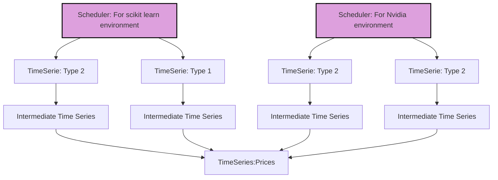
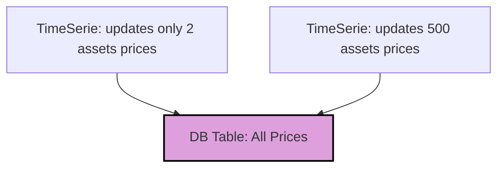
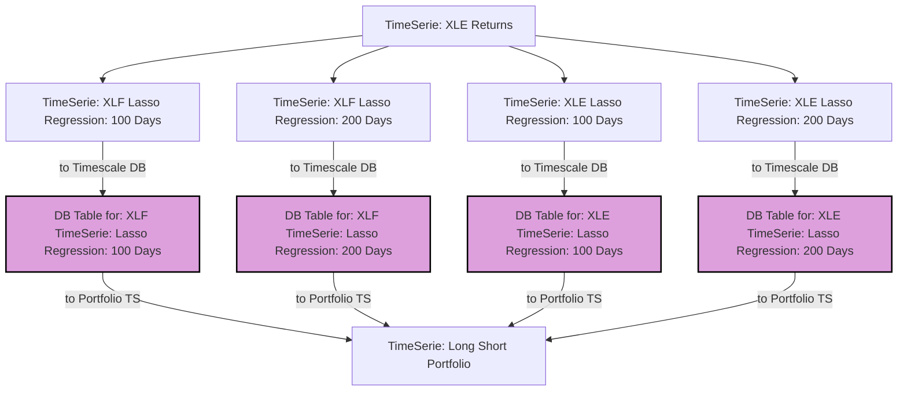
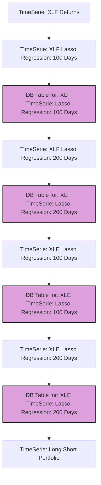

# Part 2: Running Pipelines  

In the previous section, we saw how we can build our pipelines. Now, in this section, let's look at how we can start
running them. In **TDAG**, we have mainly three ways of running our pipelines:

1. We run our pipelines as a single continuous process, persisting and reading from our database in **DEBUG Mode**.
2. We run our pipelines as a separate distributed process, where we can scale each node in the graph into a Ray cluster.
3. We can run locally using Parquet data without interacting with the database. This method is very useful for running
   fast iterations before we persist something in the database. Because, as you can imagine, continuous queries to a
   database within a loop can incur time overhead.

## Running with TDAG Schedulers

for the first two methods we will use ```Schedulers``` this object is in charge of organizing and coordinating the
update
of time series. The reason of why we have sveral schedulers and not only one scheduler its because this helps to
maintain
isolated enviroments bewteen different time series even when they become to the same pipeline lets look at one example

Making reference to our previous example we can have one scheduler that is in charge of updating all our pipeliens which
uses an environment of scikit learn , while we can have another scheduler that updates pipelines on an environment that
requires heavy machine learning libraries like Rapids and Pytorch in this case we will have somthing like this.



As you can see in the example above, schedulers can have different configurations and mixed time series dependencies. If
a time series is dependent on a particular environment, you can isolate it and allow a specific scheduler to update it
only. You can also let a time series be updated by the next available scheduler. You don't need to worry; this all
happens in the background. As you will see, setting it up is quite simple.

### Scheduler in debug mode

To Run a scheduler in debug mode first you need to create the time serie that you want to run

```python
from mainsequence.tdag import SchedulerUpdater

time_serie = ETFReplicator(lasso_alpha=.01, ticker_to_replicate="SPY", in_window=100)
SchedulerUpdater.debug_schedule_ts(
    time_serie_hash_id=time_serie.local_hash_id,
    break_after_one_update=True,
    debug=True,
    update_tree=True,
)
```

That is all! This will start a process in which the full tree will be executed sequentially. Notice that we are using
the class method `debug_schedule_ts`. What this method does is generate a new scheduler on the fly and execute the time
series in this scheduler. We could also start it in the following way:

```python
from mainsequence.tdag import SchedulerUpdater, Scheduler

scheduler = Scheduler.build_and_assign_to_ts(scheduler_name=s_name, local_hash_id_list=[time_serie.local_hash_id],
                                             delink_all_ts=False)
SchedulerUpdater.start(scheduler=scheduler, break_after_one_update=True,
                       debug=True,
                       update_tree=True, )

```

Now lets dig on the arguments

* **time_serie_hash_id**: As discussed previously, all time series are uniquely hashed. However, there are scenarios
  where we need more than one hash. For example, imagine that we have a time series that depends only on the prices of 2
  stocks, and another that depends on the prices of 500. We don't want to create a table for 2 stocks and another table
  for 500; what we want is to have two processes that update the same table with all our stocks. To achieve this, we can
  set a property in our time series called `ignore_local_kwargs`. This property will indicate which arguments we should
  ignore when creating the table, while the others will be used to hash the process. For example, like this:



* **break_after_one_update**: Setting this to **True** indicates that we want to perform only one loop rather than
  continuously having the process be updated.
* **debug**: Run in debug mode in a single process.
* **update_tree**: Update all the dependencies of the time series being scheduled.

### Scheduler in live mode

While the scheduler in debug mode is handy for testing our pipelines, we want to harness the full power of distributed
and auto-scalable systems to manage all our pipelines, regardless of their complexity. Let's go back to our original
example of the ETF replicator and assume that when we update the prices, we can take advantage of parallelization.

Imagine you are requesting prices from an API, allowing you to make batch requests using several cores instead of
relying on a single loop. In this case, you may want to set the `TimeSerie` `BarPrices` to use perhaps 10 CPUs, while
the other time series might use only 1 CPU. Alternatively, you might want one time series to use 10 CPUs and 1 GPU.

This and any other configuration is possible thanks to **TDAG**, leveraging Ray as our cluster manager. By using Ray, we
can easily distribute and parallelize our pipelines and set the requirements we need for each `TimeSerie`.

Going back to our previous example the difference between **live** and **debug** mode can be observed in the same time
serie
running differently

#### Scheduler in live mode graph



#### Scheduler in debug mode graph



### Running with Data Lake

While the previous two ways of running the pipelines are designed for maintainability, explorability, and clarity, we
realized that there is a need for a different approach to building our pipelines that could help researchers go through
the full process in a more streamlined way. This is particularly important if we want to run loops and analyses on them.

Let’s go back to our Long Short portfolio and imagine that we want to observe the hyperspace of portfolios generated by
several combinations of parameters. If we fix the tickers, we have combinations of rolling windows and regularization
parameters, which takes us to a four-dimensional space. In this case, we don’t want to persist any iteration in the
database; perhaps we just want to see at which point the interaction of the regularization parameters starts to
decrease, for example, or at which point our regression starts to stabilize. For these scenarios, we can run our
pipelines in **Data Lake** mode.

Let’s look at a code example to understand it better.

```python
data_lake_yaml_configuration = """
datalake_end: 2024-09-01 00:00:00
datalake_name: Long short portofolio
datalake_start: 2022-08-01 00:00:00
nodes_to_get_from_db: interpolatedpricestrain_c9676700655ba6d948919ca925ca82c1
persist_logs_to_file: false
"""
total_return = []
for rolling_window in range(60, 30 * 24, 20):
    for lasso_alpha in [1, 1e-2, 1e-3, 1e-4, 1e-5]:
        long_short_portfolio = LongShortPortfolio(ticker_long="XLF", ticker_short="XLE",
                                                  long_rolling_windows=[long_rollling_window],
                                                  short_rolling_windows=[100, 200], lasso_alpha=1e-2
                                                  )
        portfolio_df = long_short_portfolio.get_df_greater_than_in_table(latest_value=None)
        total_return.append(long_short_portfolio["portfolio"].iloc[-1] - 1)

```

In the previous example, if we run in Data Lake mode, each of the TimeSeries will be dumped once from the database into
a Data Lake as a Parquet file. The Data Lake will be configured in a folder structure of the following form:

``` 
DataLakeName/
├── DateRange/
│   ├── TimeSeriesHash1/parquet_partitions
│   ├── TimeSeriesHash2/parquet_partitions
│   ├── TimeSeriesHash3/parquet_partitions
│   └── ...
└── ...
```

Additionally, if we want, we can keep some TimeSeries cached in memory that are constantly being reused. This increases
the speed at which we can run our pipelines by approximately 100 times, as we read mostly from memory or disk, avoiding
networking and database overhead.

To run a TimeSeries in Data Lake mode, we only need to call the method `get_df_greater_than_in_table` of the `TimeSerie`
we want to calculate, and the tree will be updated automatically.

Now, let’s look at how we can visualize and manage all our pipelines in the GUI. Continue
to [Part 3: The TDAG Explorer](tdag_explorer_part3.md).
