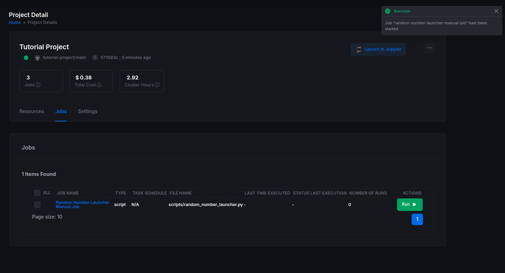
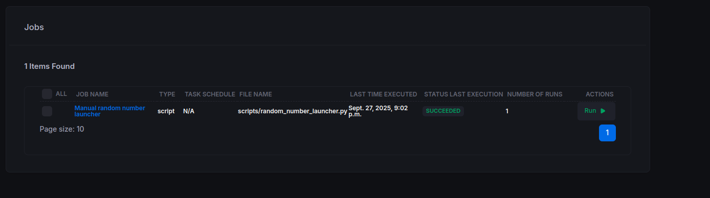

# Getting Started 3: Orchestration

Now that you’ve built and tested your `DataNode`s locally, it’s time to **orchestrate** them on the Main Sequence Platform. This guide improves clarity and grammar while keeping your original images and code blocks intact.

## 1) Update Your Environment

Before scheduling anything, make sure your environment is consistent and your latest changes are committed.

1. **Compile dependencies** from your declared deps into `requirements.txt` (most common flow):

```shell
uv pip compile pyproject.toml --universal -o requirements.txt
```

2. **Commit and push** your changes.

```shell
git add -A        # stages new, modified, and deleted files
git commit -m "Tutorial files"
```

3. **Push to the repository.**  
   Because this is a private, security‑backed repo behind the Main Sequence Platform, you’ll need a **signed terminal** that loads the correct cryptographic key.

   Open a signed terminal via the CLI:

```shell
python -m mainsequence project open-signed-terminal 60
```

   Then push:

```shell
#commit your changes
git push
```

## 2) Scheduling Jobs

You can run jobs **manually** or **automatically** on a schedule.

### 2.1 Manual Run

1. Open your Tutorial Project:  
   https://main-sequence.app/projects/?search=tutorial

2. In the file browser, navigate to the project. It should look similar to:


3. Click the **scripts** folder and select **Create Job +** on any of the launcher scripts. Name it, for example, **Random Number Launcher — Manual Job**.


4. After creation, the job will appear under the **Jobs** tab. Because it’s not scheduled, nothing has run yet. Click **Run** to execute it manually.

You’ll see a confirmation toast in the top‑right corner:



5. Click the job to view its **Job Runs**. Wait for the run to complete to see the results.



### 2.2 Automatic Schedule

As projects and workflows grow, you’ll usually want **automation described as code**. You can define jobs and schedules within your project repo.

Create a file named **`project_configuration.yaml`** at the **repository root** with the following structure:

```yaml
name: "Tutorial job Configuration"
jobs:
  - name: "Simulated Prices"
    resource:
      script:
        path: "scripts/simulated_prices_launcher.py"
    schedule:
      type: "crontab"
      expression: "0 0 * * *"
```

Commit and push this file; the platform will detect it and create the scheduled job automatically.


