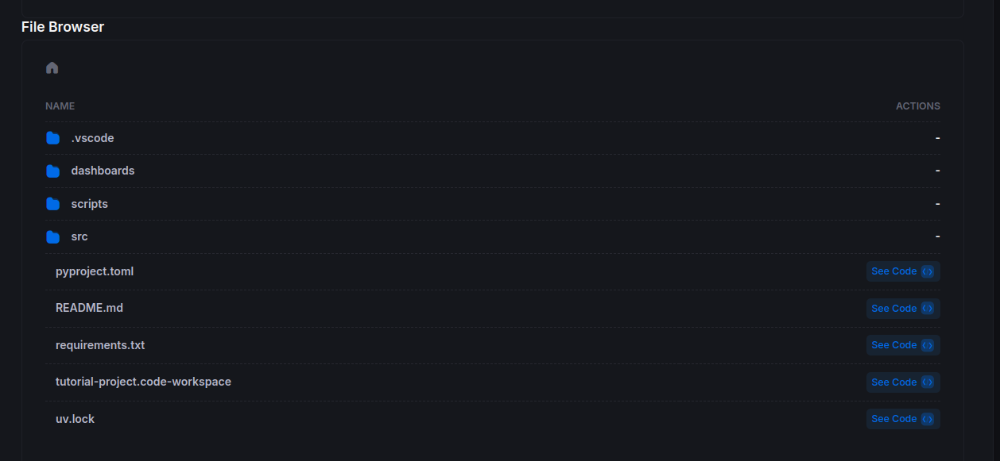
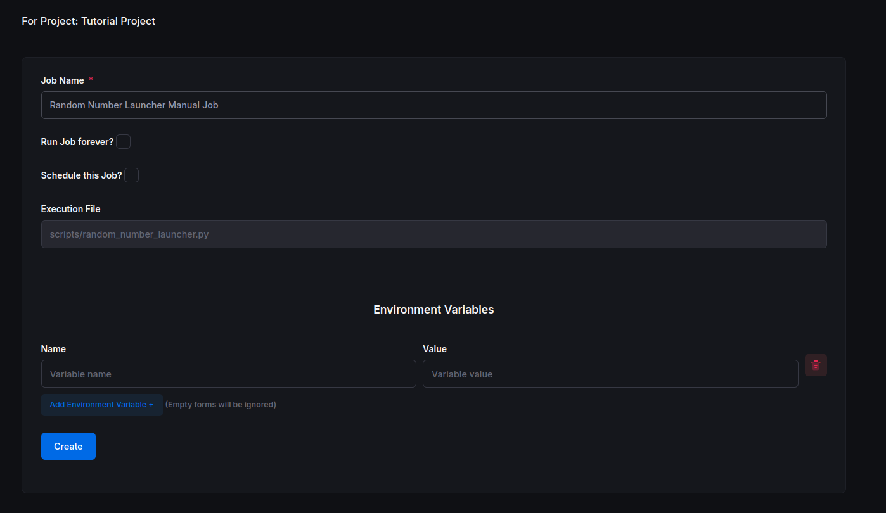
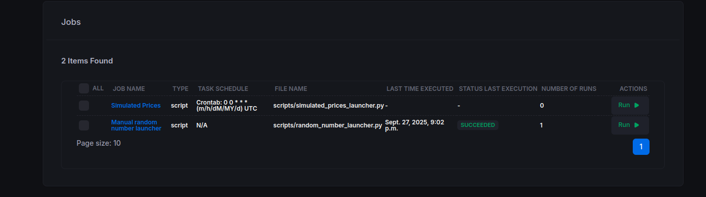

# Getting Started 3: Orchestration

Now that you've built and tested your `DataNode`s locally, it's time to **orchestrate** them on the Main Sequence Platform. This involves **scheduling** your data pipelines to run automatically or on demand.

## 1) Update Your Environment

Before scheduling anything, make sure your environment is consistent and your latest changes are committed.

1. **Activate your virtual environment** (if not already active):

   Windows PowerShell:
   ```powershell
   .\venv\Scripts\Activate
   ```
   Linux/macOS:
   ```bash
   source .venv/bin/activate
   ```

2. **Compile dependencies** from your declared deps into `requirements.txt` (most common flow):

   ```powershell
   uv pip compile pyproject.toml --universal -o requirements.txt
   ```

3. **Commit your changes:**

   ```powershell
   git add -A        # stages new, modified, and deleted files
   git commit -m "Tutorial files"
   ```

4. **Push to the repository.**  
   Because this is a private, security‑backed repo behind the Main Sequence Platform, you'll need a **signed terminal** that loads the correct cryptographic key.

   Open a signed terminal via the CLI:

   ```powershell
   mainsequence project open-signed-terminal [PROJECT_ID]
   ```
   **Note:**
   Replace `[PROJECT_ID]` with your actual project ID (e.g., `60`).

   Then push your changes:

   ```powershell
   git push
   ```

## 2) Scheduling Jobs

You can run jobs **manually** or **automatically** on a schedule.

### 2.1 Manual Run

1. Open your Tutorial Project:  
   https://main-sequence.app/projects/?search=tutorial

2. In the file browser, navigate to the project. It should look similar to:



3. Click the **scripts** folder and select **Create Job +** on any of the launcher scripts. Name it, for example, **Random Number Launcher — Manual Job**.



4. After creation, the job will appear under the **Jobs** tab. Because it's not scheduled, nothing has run yet. Click **Run** to execute it manually.

You'll see a confirmation toast in the top‑right corner:


5. Click the job to view its **Job Runs**. Wait for the run to complete to see the results.


### 2.2 Automatic Schedule

As projects and workflows grow, you'll usually want **automation described as code**. You can define jobs and schedules within your project repo.

Create a file named **`project_configuration.yaml`** at the **repository(your project) root**.

**Windows path example:** `C:\Users\<YourName>\mainsequence\<YourOrganization>\projects\tutorial-project\project_configuration.yaml`

**macOS/Linux path example:** `/home/<YourName>/mainsequence/<YourOrganization>/projects/tutorial-project/project_configuration.yaml`

Add the following content to the `project_configuration.yaml` to schedule the `simulated_prices_launcher.py` to run daily at midnight:

```yaml
name: "Tutorial job Configuration"
jobs:
  - name: "Simulated Prices"
    resource:
      script:
        path: "scripts/simulated_prices_launcher.py"
    schedule:
      type: "crontab"
      expression: "0 0 * * *"
```

**Note:** In the YAML file, always use forward slashes (`/`) for the script path, even on Windows. The platform will handle path conversion automatically.

Commit and push this file with a signed terminal as you did before.
```powershell
mainsequence project open-signed-terminal [PROJECT_ID]
```
**Note:** Replace `[PROJECT_ID]` with your actual project ID (e.g., `60`).

Than in new terminal window that opens, run:

```powershell
git add project_configuration.yaml
git commit -m "Add automated job schedule"
git push
```

The platform will detect it and create the scheduled job automatically:

